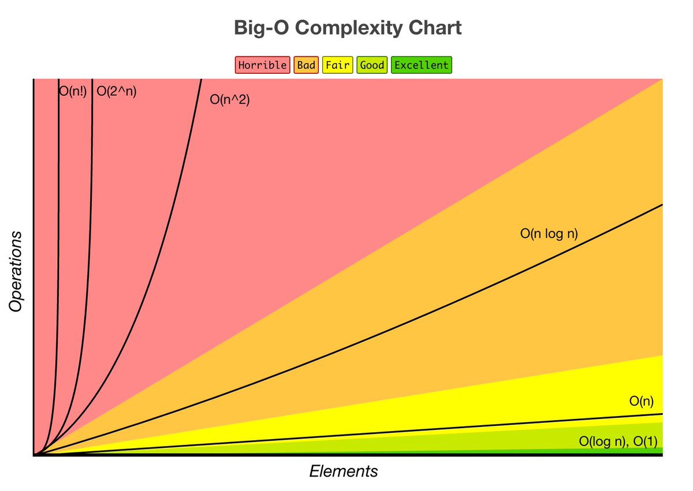

# Алгоритми

### Алгоритм - це набір послідовних дій, які вирішують якусь задачу.

### Основні складності алгоритмів:

- O(1)
- O(Log2n)
- O(n)
- O(n \* Log2n)
- O(n^2)
- O(n!)

### Основні складності алгоритмів можна розділити на такі категорії:

- Часова складність (Time Complexity):
  - Часова складність оцінює, скільки часу займає виконання алгоритму в залежності від розміру вхідних даних.
  - Оцінка часової складності зазвичай виражається в "O-нотації" (наприклад, O(1), O(log n), O(n), O(n^2), O(2^n)).
- Просторова складність (Space Complexity):
  - Просторова складність оцінює, скільки пам'яті займає алгоритм в залежності від розміру вхідних даних.
  - Оцінка просторової складності також виражається в "O-нотації".
- Складність пошуку (Search Complexity):
  - Ця складність пов'язана з операціями пошуку елемента в колекції даних.
  - Різні структури даних мають різні складності пошуку. Наприклад, пошук в масиві може бути O(n), а в хеш-таблиці - O(1).
- Складність сортування (Sorting Complexity):
  - Оцінює, скільки часу і/або пам'яті потрібно для впорядкування елементів.
  - Популярні алгоритми сортування включають сортування бульбашкою, сортування вибором, швидке сортування, сортування злиттям та інші.
- Складність пам'яті (Memory Complexity):
  - Пов'язана з використанням пам'яті алгоритмом.
  - Деякі алгоритми можуть витрачати більше пам'яті, ніж інші, і це може бути критичним у обмежених середовищах.
- Складність паралелізації (Parallelization Complexity):
  - Складність алгоритмів може бути пов'язана з їхньою здатністю до розпаралелювання, тобто до виконання в кількох потоках або процесах одночасно.
- Складність адаптації до змін у даних (Adaptivity Complexity):
  - Ця складність визначає, наскільки легко алгоритм може адаптуватися до змін у даних або змінюючихся умов.
- Складність підтримки (Maintenance Complexity):
  - Складність, пов'язана з підтримкою, оновленням і налагодженням коду, який реалізує алгоритм.
- Складність стійкості (Robustness Complexity):
  - Ця складність визначає, наскільки стійкий алгоритм до помилок у даних або некоректного використання.
- Складність паралелізації (Parallelization Complexity):
  - Складність, пов'язана з можливістю та ефективністю розпаралелювання виконання алгоритму на кількох ядрах процесора.

### Структури:

- Масиви:
  - Масиви представляють собою впорядковані колекції елементів одного або різних типів даних.
  - Елементи в масиві доступні за індексом.
  - У JavaScript масиви динамічно розширюються, коли додаються нові елементи.
- Об'єкти:
  - Об'єкти представляють собою колекції пар ключ-значення.
  - Ключі (або властивості) є рядками і використовуються для доступу до значень.
  - Об'єкти в JavaScript широко використовуються для організації та зберігання даних.
- Зв'язаний список:
  - Зв'язаний список складається з вузлів, кожен з яких містить значення і посилання на наступний вузол (або null, якщо це останній вузол).
  - Пошук в зв'язаному списку може вимагати проходження через всі вузли.
- Черга:
  - Черга - це структура даних, де елементи додаються в кінець (enqueue) і видаляються з початку (dequeue).
  - Черги використовуються для управління даними в порядку їх додавання.
- Стек:
  - Стек - це структура даних, де елементи додаються і видаляються з одного кінця (вершини стеку).
  - Операції над стеком включають в себе push (додавання) і pop (видалення) елементів.
  - Стеки використовуються, наприклад, для реалізації зворотнього польського запису.
- Сет:
  - Сет представляє собою колекцію унікальних елементів без дублікатів.
  - У JavaScript існує вбудований об'єкт Set для роботи з множинами.
- Мапа:
  - Мапа - це колекція пар ключ-значення, де ключі можуть бути будь-якого типу даних.
  - У JavaScript існує вбудований об'єкт Map для роботи з картами.
- Бінарне дерево:
  - Бінарне дерево - це ієрархічна структура даних, в якій кожен вузол має не більше двох нащадків.
  - Бінарні дерева часто використовуються для швидкого пошуку та сортування даних.
- n-арне дерево:
  - n-арне дерево - це структура даних, в якій кожен вузол може мати кілька нащадків (більше двох).
  - Воно часто використовується для подання ієрархічних даних, таких як файлові системи.
- Графи:
  - Графи представляють собою сукупність вершин і ребер, які з'єднують ці вершини.
  - Графи можуть бути напрямленими (орієнтованими) або не напрямленими.
  - Графи використовуються для моделювання зв'язків між об'єктами і вирішення різних завдань, таких як пошук шляху та аналіз мереж.
- Хеш-таблиця:
  - Хеш-таблиця (або хеш-мап) - це структура даних в JavaScript, призначена для ефективного зберігання та пошуку пар "ключ-значення". Ось основні елементи структури даних хеш-таблиці в JavaScript:
    - Хеш-функція: Це функція, яка приймає ключ (зазвичай рядок) і перетворює його в числове значення, яке називається хешем. Хеш-функція повинна бути швидкою і однозначною, щоб забезпечити швидкий доступ до даних.
    - Масив (ведра): Хеш-таблиця фактично представляє собою масив (або масиви) елементів, які називаються "ведрами" або "buckets". Ці ведра зберігають фактичні дані.
    - Колізії: Іноді два різних ключа можуть мати однаковий хеш. Це називається колізією. Різні хеш-таблиці можуть використовувати різні методи вирішення колізій, такі як ланцюжки (зберігання колізійних елементів у вигляді списків) або відкрите хешування (спроба знайти інший вільний слот).
    - Операції: Основні операції з хеш-таблицями включають вставку (додавання пари "ключ-значення"), пошук (пошук значення за ключем) і видалення (видалення пари "ключ-значення").

### Деякі з найпоширеніших алгоритмів та структур даних, які використовуються в JavaScript:

- Сортування масивів:
  - Сортування бульбашкою (Bubble Sort): Простий алгоритм сортування, який послідовно порівнює та міняє елементи, доки масив не буде відсортований.
  - Сортування вставками (Insertion Sort): Цей алгоритм послідовно вставляє елементи в відсортовану частину масиву.
  - Сортування вибором (Selection Sort): Алгоритм знаходить мінімальний елемент і переміщує його на початок масиву.
  - Швидке сортування (Quick Sort): Ефективний рекурсивний алгоритм сортування, який розбиває масив на підмасиви та сортує їх.
- Пошук елементів:
  - Лінійний пошук (Linear Search): Послідовний пошук елемента в масиві.
  - Бінарний пошук (Binary Search): Ефективний алгоритм пошуку в відсортованих масивах, який ділить масив пополам та порівнює шуканий елемент з середнім елементом.
- Структури даних:
  - Масиви (Arrays): Впорядковані списки елементів, доступ до яких здійснюється за індексом.
  - Зв'язані списки (Linked Lists): Структури даних, що складаються з вузлів, де кожен вузол містить значення та посилання на наступний вузол.
  - Стеки (Stacks): Структури даних, які працюють за принципом "останній увійшов, перший вийшов" (LIFO).
  - Черги (Queues): Структури даних, які працюють за принципом "перший увійшов, перший вийшов" (FIFO).
  - Хеш-таблиці (Hash Tables): Структури даних, які використовують хеш-функції для швидкого пошуку елементів.
- Рекурсія:
  - Рекурсивні функції можуть викликати самих себе для вирішення задачі. Прикладом може слугувати рекурсивний пошук факторіала числа.
- Сортування та фільтрація масивів:
  - Сортування та фільтрація масивів: JavaScript надає методи, такі як sort(), filter(), map(), reduce(), які дозволяють легко маніпулювати масивами.
- Алгоритми обходу дерев:
  - Якщо вам потрібно працювати з деревоподібними структурами даних, такими як об'єкти або DOM-дерева, то вам знадобляться алгоритми обходу дерев, наприклад, обхід у глибину (DFS) або обхід у ширину (BFS).
- Графи:
  - Для роботи з графами, такими як соціальні мережі або схеми зв'язків, можуть знадобитися алгоритми обходу графів, такі як алгоритм Дейкстри або алгоритм пошуку в глибину (DFS).

